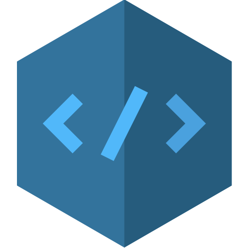
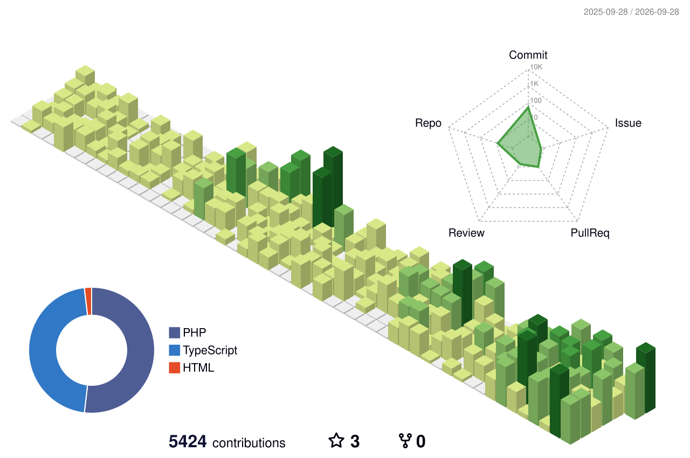
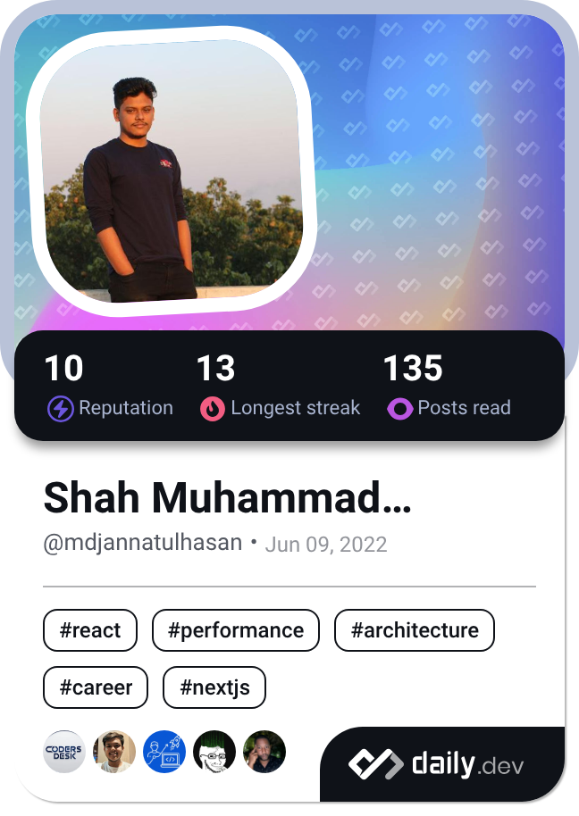

  

  
  
  
  
  
  

<table>
<tr>
<td width="55%" valign="top">

### 👨‍💻 About me

Full-stack software engineer from Bangladesh 🇧🇩 with **5+ years** of shipping web and mobile products. Laravel and React/Next.js are home; WordPress, React Native and Rails are close by.

- 💼 **Now:** Software Engineer @ **BluBird Interactive**
- 🧑‍🤝‍🧑 Led a team of 5 and built ~80% of the APIs
- 🌍 Worked remotely for Netmark, Norway
- 🎓 BSc CSE, BRAC University · IEEE ICAICT 2020 author
- ♟️ Former General Secretary, BRAC University Chess Club

</td>
<td width="45%" valign="top" align="center">

</td>
</tr>
</table>

### 🚀 Tech stack

   
   
  

### 💼 Experience

| When        | Where                                                 | Highlights                                                                                     |
| ----------- | ----------------------------------------------------- | ---------------------------------------------------------------------------------------------- |
| 2025 – now  | **BluBird Interactive** · Assistant Software Engineer | Rails CRM UX refactor, Custom WordPress A/B testing plugin, Multi-tenant System, and many more |
| 2024 – 2025 | **Dhaka JACOS** · Full-stack Software Engineer        | Led 5 engineers, ~80% of Laravel APIs, ~60% of React UI, UI load time −25%                     |
| 2023 – 2024 | **Quantic Dynamics** · Full-stack Developer (MERN)    | ~90% of Next.js UI, ~60% of the React Native app's core                                        |
| 2021 – 2022 | **Netmark, Norway** · Frontend Developer (remote)     | React/Next sites, WordPress themes (ACF, Timber), Laravel e-commerce                           |

### 📊 GitHub stats

  

  
  

  

### 🧊 Contributions in 3D

<picture>
  <source media="(prefers-color-scheme: dark)" srcset="./profile-3d-contrib/profile-night-rainbow.svg">
  
</picture>

### 🧩 LeetCode & daily.dev

  
  

<picture>
  <source media="(prefers-color-scheme: dark)" srcset="https://raw.githubusercontent.com/mdjannatulhasan/mdjannatulhasan/output/github-contribution-grid-snake-dark.svg">
  
</picture>

