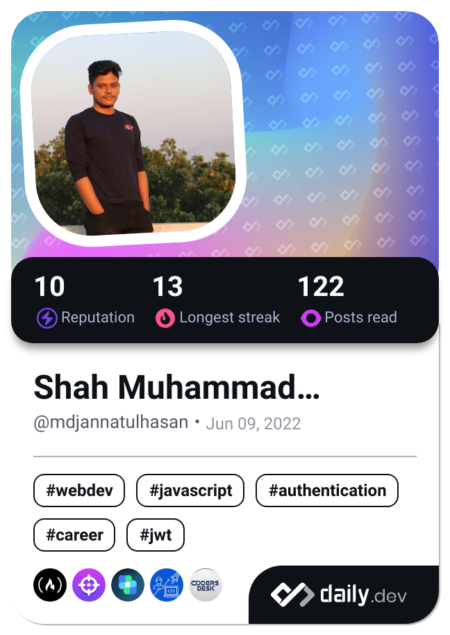
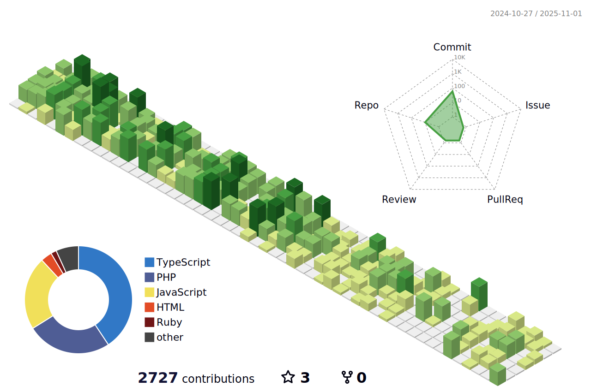

    +Welcome+to+my+profile!;Have+a+look+around!" alt="Hasan's intro SVG" />

    

## :bulb: Skills
          	      

## 📈 Leetcode Stats

  

## 📑 Daily.dev Stats

## 📈 Github Stats

  

<picture>
  <source media="(prefers-color-scheme: dark)" srcset="https://raw.githubusercontent.com/mdjannatulhasan/mdjannatulhasan/output/github-contribution-grid-snake-dark.svg">
  <source media="(prefers-color-scheme: light)" srcset="https://raw.githubusercontent.com/mdjannatulhasan/mdjannatulhasan/output/github-contribution-grid-snake.svg">
  
</picture>
